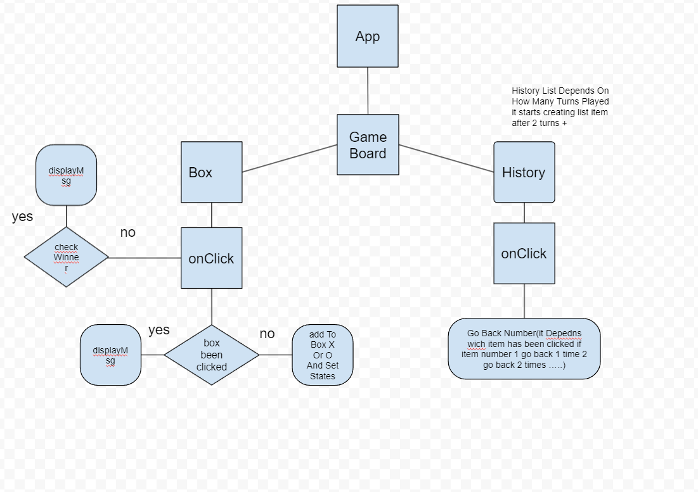

<font size="10"> Tic Tac Toe </font>

---

# Description

<br/>

is ​​a two-player sequel game on a 3x3 slot board. Each player in turn marks a mark in one of the continuation of packer porters. The winner is the one who managed to fill a line, column or diagonal in his marks. If a player failed to do so until all the other girls were full, the game ended in a draw.
<br/>
<br/>

### Installation

use npm package manager

```bash
npm install
```

# Steps To Build The Project


